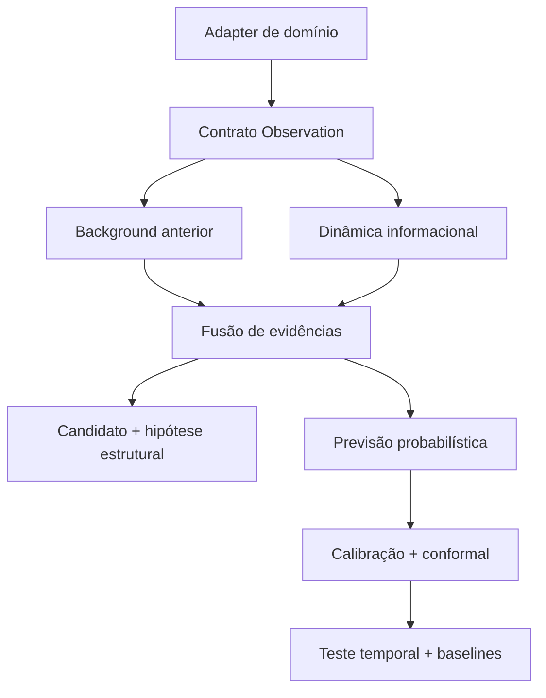

# QUASAR Discovery Engine

**Quantified Uncertainty Analysis for Signals, Anomalies, and Regimes**

QUASAR é uma primeira prova de conceito local para descobrir mudanças emergentes em séries de dados. O nome vem dos quasares: objetos astrofísicos muito distantes cuja estrutura é inferida combinando observações, ruído, incerteza e evidências acumuladas.

> Em uma frase: o sistema aprende o comportamento esperado, combina pequenos desvios, cria candidatos, estima probabilidades e deixa dados futuros testarem se a previsão se sustentou.

## Para quem não é técnico

Imagine um telescópio apontado para dados. Um ponto diferente pode ser apenas ruído. Vários sinais pequenos mudando juntos podem indicar algo que merece investigação. O QUASAR:

1. observa como o sistema normalmente se comporta;
2. mede mudanças em distribuições, dependências e regimes;
3. combina essas evidências em uma pontuação rastreável;
4. produz uma previsão probabilística;
5. compara a previsão com dados futuros que estavam separados;
6. registra acertos e erros.

Ele não afirma automaticamente “isto é fraude”, “isto é uma descoberta astronômica” ou “isto foi causado por X”. Ele aponta candidatos que precisam de validação.

## O que esta POC entrega

| Camada | Implementado agora | Limite assumido |
|---|---|---|
| Contrato comum | Observações, evidências, candidatos, hipóteses e previsões com validação Pydantic | Somente features numéricas na primeira versão |
| Background | Média/desvio ou mediana/MAD incremental por fonte | Ainda sem ARIMA, Prophet, LightGBM ou XGBoost |
| Dinâmica informacional | Entropia, informação mútua, Jensen-Shannon, mudança de média e variância | Estimadores leves para POC, não estado da arte final |
| Emergência | Fusão ponderada transparente e boost por evidências convergentes | Pesos fixos, sujeitos a ablation e otimização futura |
| Forecast | Probabilidade logística, temperature scaling e intervalo split-conformal | Intervalos binários podem ser largos em amostras pequenas |
| Falsificação | Ordem temporal, calibração passada e teste futuro separado | Dados sintéticos não validam desempenho no mundo real |
| Domínios | Fraude/surveillance e astronomia sintéticas | Nenhum dataset real é incluído |
| Operação | CLI, artefatos locais, Docker, API REST opcional | Sem autenticação, fila, banco ou cloud na POC |
| Agentes | Contrato de governança documentado | Nenhum LLM participa do caminho crítico |

## Resultado de referência reproduzível

Execução: `360` pontos, seed `42`, configuração padrão, máquina local usada na construção.

| Domínio | AUPRC | AUROC | Brier | ECE | Coverage | Lead time médio |
|---|---:|---:|---:|---:|---:|---:|
| Fraude sintética | 0,664 | 0,935 | 0,055 | 0,091 | 0,929 | 1,67 passos |
| Astronomia sintética | 0,759 | 0,957 | 0,047 | 0,097 | 0,881 | 3,33 passos |

Leitura honesta: a fusão apresentou Brier menor e menos falsos positivos que o baseline somente por resíduo, mas esse baseline teve AUPRC e recall maiores. Isso é complementaridade e trade-off, não superioridade geral. A cobertura astronômica ficou ligeiramente abaixo dos 90% solicitados nesta amostra finita. Esses resultados são evidência de funcionamento da POC, não evidência científica em dados reais.

## Início rápido

### Windows PowerShell

```powershell
py -3.13 -m venv .venv
.\.venv\Scripts\Activate.ps1
python -m pip install --upgrade pip
python -m pip install -e .
quasar demo --domain all --points 360 --seed 42
```

### Linux ou macOS

```bash
python3 -m venv .venv
source .venv/bin/activate
python -m pip install --upgrade pip
python -m pip install -e .
quasar demo --domain all --points 360 --seed 42
```

Não é preciso criar `.env`, fornecer chave de API, conectar banco ou ter acesso à internet depois que as dependências Python estiverem instaladas.

Saída esperada:

```text
QUASAR POC completed
- fraud: candidates=..., AUPRC=..., Brier=..., ECE=..., coverage=...
- astronomy: candidates=..., AUPRC=..., Brier=..., ECE=..., coverage=...
Artifacts: .../runs/demo
```

## Arquivos gerados

Cada domínio recebe uma pasta com:

- `results.json`: métricas, baselines, comparações e indicadores GO/NO-GO;
- `run_manifest.json`: seed, versão, plataforma e hash da configuração;
- `predictions.jsonl`: probabilidades brutas/calibradas, intervalos, partição temporal e rótulo revelado;
- `candidates.jsonl`: candidatos e evidências quantitativas;
- `hypotheses.jsonl`: hipótese estrutural, previsão testável e critério de rejeição.

Os rótulos aparecem nos artefatos somente para avaliação. O teste `test_labels_cannot_change_predictions` comprova que eles não entram no caminho de detecção.

## Arquitetura da POC



A matemática é compartilhada integralmente pelos dois experimentos. Apenas o adapter e as features mudam.

## Contrato mínimo de entrada

Um sistema futuro pode produzir um JSON por linha no formato abaixo:

```json
{
  "timestamp": "2026-08-23T14:30:00Z",
  "source_id": "sensor_A",
  "entity_id": "entity_42",
  "features": {"signal_a": 1.4, "signal_b": 0.32},
  "relations": [],
  "context": {"domain": "my_domain"},
  "target_future": null
}
```

Valide e execute dados próprios:

```bash
quasar validate-data --input observations.jsonl
quasar run --input observations.jsonl --output-dir runs/my_domain
```

`target_future` é opcional para uso operacional e só deve existir em treino/avaliação. Consulte [Como adicionar um domínio](docs/ADDING_A_DOMAIN.md).

## Testes

```bash
python -m unittest discover -s tests -v
```

O pacote não exige `pytest`. O benchmark de 1.000 observações é opt-in:

```bash
RUN_QUASAR_BENCHMARKS=1 python -m unittest tests.benchmarks.test_performance -v
```

## Docker

```bash
docker compose up --build
```

Os artefatos ficam em `./runs`. O container é somente leitura, exceto pelo volume de saída e `/tmp`.

## API opcional

A POC funciona sem API. Para expor localmente `/health` e `/detect`:

```bash
python -m pip install -e ".[api]"
quasar serve --host 127.0.0.1 --port 8000
```

Não exponha esta API na internet sem autenticação, limites, isolamento, observabilidade e revisão de segurança.

## Regras científicas incorporadas

- ordem temporal obrigatória: background antes, calibração depois, teste futuro por último;
- rótulos futuros nunca entram no detector;
- probabilidades, Brier, log-loss, ECE e coverage são registradas;
- baselines de taxa-base, resíduo e mudança de média são comparados;
- previsões fracassadas permanecem nos artefatos;
- hipóteses são estruturais e `causal_claim=false` por padrão;
- seed, versão, configuração e ambiente são registrados;
- agentes não podem promover sozinhos um candidato a descoberta.

## Estrutura principal

```text
src/quasar_engine/
├── core/          # contrato, background, dinâmica, emergência, forecast e validação
├── adapters/      # fraude, astronomia e template de novo domínio
├── agents/        # protocolo futuro; não executado na POC
├── storage/       # persistência local + pontos de extensão
├── monitoring/    # profiling, logs e métricas locais
├── api/           # superfície REST opcional
└── cli/           # demo, run, validate-data, show-config e serve
```

## Próximas etapas corretas

1. fixar o protocolo e rodar pelo menos 30 seeds;
2. adicionar datasets públicos reais, com versão, licença e checksum;
3. incluir Isolation Forest, PELT e um forecasting específico do domínio;
4. executar ablations e intervalos de confiança entre seeds;
5. medir escalabilidade em 10³, 10⁴, 10⁵ e 10⁶ observações;
6. somente depois avaliar agentes investigativos e uma vertical de produto.

## Documentação

- [Guia de início](docs/GETTING_STARTED.md)
- [Explicação não técnica](docs/FOR_NON_TECHNICAL.md)
- [Arquitetura](docs/ARCHITECTURE.md)
- [Protocolo científico](docs/SCIENTIFIC_PROTOCOL.md)
- [Experimentos e métricas](docs/EXPERIMENTS.md)
- [Como adicionar um domínio](docs/ADDING_A_DOMAIN.md)
- [Referência da API Python](docs/API_REFERENCE.md)
- [Limitações e riscos](docs/LIMITATIONS.md)
- [Como contribuir](docs/CONTRIBUTING.md)

## Licença

Apache-2.0. Antes de publicar ou buscar proteção intelectual, faça revisão jurídica e busca de anterioridade; esta licença não é uma conclusão sobre patenteabilidade.

