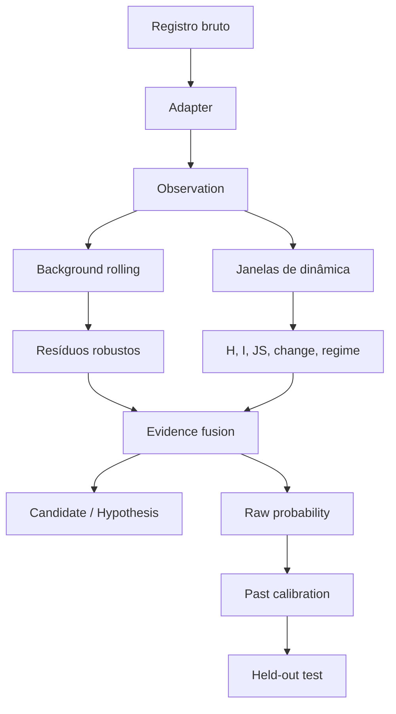

# Arquitetura

## Princípios

1. **Core independente do domínio.** Adapters traduzem dados; não alteram a matemática.
2. **Sem vazamento temporal.** O ponto atual é pontuado antes de entrar no background.
3. **Evidência antes da narrativa.** Candidatos guardam as contribuições numéricas.
4. **Probabilidade antes da certeza.** Forecasts têm calibração e intervalos.
5. **Falsificação automática.** O futuro separado testa a previsão.
6. **Integração por bordas.** CLI, API e storage dependem do core; o core não depende deles.

## Fluxo detalhado

## Dependências permitidas

O core usa somente NumPy, Pydantic e PyYAML. FastAPI e Uvicorn são extras opcionais. Isso reduz instalação, superfície de falha e acoplamento a cloud.

## Estado e streaming

`DiscoveryPipeline` mantém uma janela por `source_id`. `background.score()` é chamado antes de `background.update()`. Essa separação explícita protege contra o uso acidental do ponto atual como parte do comportamento esperado.

Em produção, o estado poderá migrar para Redis, banco de séries, streaming state store ou serviço gerenciado. O contrato não define fornecedor.

## Complexidade

Para `F` features, janela `W` e `N` observações, a implementação atual é aproximadamente `O(N × (F×W + F²×W))`; pares de informação mútua são limitados às primeiras quatro features. O armazenamento por fonte é limitado pela janela configurada. Benchmarks reais ainda devem testar cardinalidade de fontes e missing data.

## Extensões planejadas

- Backgrounds: ARIMA, modelos boosting e ensembles.
- Dinâmica: PELT, change point Bayesiano e HMM.
- Baselines: Isolation Forest, autoencoders e modelos específicos do domínio.
- Storage: S3/GCS/Azure e PostgreSQL.
- Operação: autenticação, filas, idempotência, tracing, SLOs e revisão de segurança.
- Agentes: investigação e crítica somente depois dos gates quantitativos.

