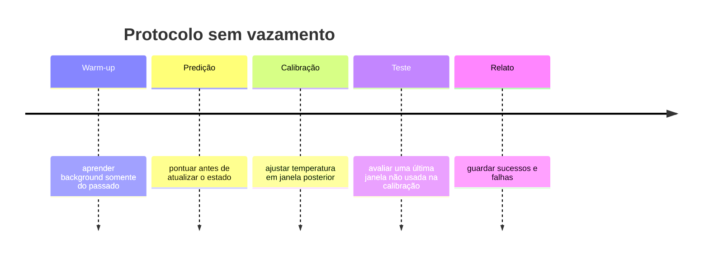

# Protocolo científico

## Pergunta da POC

O mesmo core pode transformar sinais moderados e distribuídos em previsões temporais úteis em dois domínios sintéticos diferentes, com incerteza registrada e sem usar rótulos futuros durante a detecção?

## Hipóteses

- H1: a fusão alcança melhor qualidade probabilística que baselines registrados.
- H2: a mesma implementação central funciona nos dois domínios sem reescrita.
- H3: a previsão pode produzir lead time positivo para parte dos eventos.

Essas hipóteses são testadas apenas na distribuição sintética registrada. Não se transferem automaticamente para fraude real ou astronomia real.

## Ordem temporal



## Métricas

- **Brier e log-loss:** qualidade das probabilidades; menor é melhor.
- **ECE:** distância entre confiança e frequência observada; menor é melhor.
- **Coverage:** proporção de alvos cobertos pelos intervalos.
- **AUROC/AUPRC:** ordenação discriminativa; AUPRC é especialmente útil em eventos raros.
- **Precision/Recall/FPR:** trade-off operacional em threshold 0,5.
- **Lead time:** antecedência média dos alertas antes do início de episódios.
- **Tempo, memória e throughput:** viabilidade computacional inicial.

## Baselines registrados

1. taxa-base constante aprendida na calibração;
2. resíduo robusto isolado;
3. mudança de média isolada.

POC v0.1 ainda precisa adicionar Isolation Forest, PELT, forecasting convencional e um baseline específico por domínio antes de qualquer paper de comparação.

## Ablation

Execute:

```bash
python scripts/run_ablation.py --domain all --points 360 --seed 42
```

O script remove uma evidência por vez mantendo seed, dados e protocolo. Para inferência mais sólida, execute no mínimo 30 seeds e reporte média, desvio/IC e todos os resultados.

## Critérios GO/NO-GO

**GO para a próxima fase** exige ganho consistente contra baselines, calibração aceitável, lead time útil, core compartilhado e custo controlado.

**NO-GO/reformulação** ocorre se o ganho desaparecer, a calibração falhar repetidamente, o custo crescer sem valor ou cada domínio exigir outro core.

